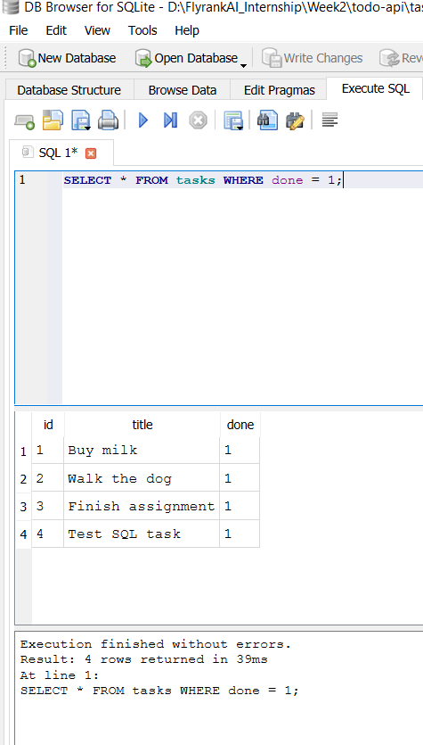

# Task API

A simple CRUD API for managing a to-do list, built with FastAPI as part of the FlyRank Internship — Backend Track, Week 2.

## What this is

This API lets you create, read, update, and delete tasks (CRUD). Data is stored in a SQLite database (`tasks.db`) — it survives server restarts.

> Note: this project started out with in-memory storage (a Python list that reset on every restart). See the "Update: Database" section below for how and why that changed.

## How to run it

1. Clone this repo and navigate into it:
   ```
   git clone https://github.com/israr-ax/todo-api.git
   cd todo-api
   ```
2. Create and activate a virtual environment:
   ```
   python -m venv venv
   venv\Scripts\Activate.ps1   # Windows
   source venv/bin/activate    # Mac/Linux
   ```
3. Install dependencies:
   ```
   pip install -r requirements.txt
   ```
4. Run the server:
   ```
   uvicorn main:app --reload
   ```
5. Open `http://localhost:8000` in your browser, or `http://localhost:8000/docs` for Swagger UI.

The `tasks.db` file is created automatically on first run — no extra setup needed.

## Endpoints

| Method | Path              | Description                        |
|--------|-------------------|-------------------------------------|
| GET    | /                 | API info                           |
| GET    | /health           | Health check                       |
| GET    | /tasks            | List all tasks (supports `?done=` and `?search=`) |
| GET    | /tasks/{id}       | Get a single task                  |
| POST   | /tasks            | Create a new task                  |
| PUT    | /tasks/{id}       | Update a task                      |
| DELETE | /tasks/{id}       | Delete a task                      |
| GET    | /stats            | Task statistics (total/done/open)  |
| POST   | /reset            | Reset tasks to default 3 examples  |

## Example curl output

```
curl -i -X POST http://localhost:8000/tasks -H "Content-Type: application/json" -d "{\"title\":\"Test task\"}"

HTTP/1.1 201 Created
content-type: application/json

{"id":5,"title":"Test task","done":0}
```

## Swagger UI

Interactive docs are available at `/docs`.


## The mortality experiment

When the server restarted (back when tasks were stored in memory), only the 3 hardcoded example tasks remained — any tasks created during the session were lost. This happened because data was stored in memory (a Python list), which only exists while the program is running. This is exactly what the database update below fixes.

## Update: Database (Week 2 / A2)

This project has been upgraded from in-memory storage to a real **SQLite** database.

### Why SQLite

SQLite was chosen because it needs no separate server or installation — it's a single file (`tasks.db`) that Python can read and write directly using the built-in `sqlite3` module. That made it a good fit for a small project like this, where the goal is to prove persistence without adding infrastructure complexity.

### Where the database lives

The database is stored as `tasks.db` in the project root. It's created automatically the first time the app runs. The `tasks` table is also created automatically if it doesn't exist, and the 3 example tasks are only inserted the first time — so restarting the server doesn't duplicate them.

### What changed vs. what didn't

The API itself didn't change — same endpoints, same request/response shapes, same status codes. Only the storage layer changed: `GET`, `POST`, `PUT`, `DELETE`, `/stats`, and `/reset` now run real SQL queries against `tasks.db` instead of reading/writing a Python list.

### Proving persistence

To confirm data survives a restart:

1. Created a new task via `POST /tasks`.
2. Stopped the server (`Ctrl+C`).
3. Restarted it (`uvicorn main:app --reload`).
4. Ran `GET /tasks` again — the new task was still there.

This is the opposite of the mortality experiment above — the whole point of moving to SQLite.

### Exploring the database manually

Opened `tasks.db` in **DB Browser for SQLite** and ran some queries directly against the table, for example:

```sql
SELECT * FROM tasks WHERE done = 1;
```

Changes made this way (e.g. `UPDATE tasks SET done = 1;`) were immediately visible through the API on the next `GET /tasks` call — confirming the API and the database are genuinely connected, not just running side by side.



## AI vs me

**My prompt:**
> Create a todo-api on FASTAPI. which have 5 endpoints (GET all tasks, GET one task, POST, PUT and DELETE), when we fire a endpoint it print the exact status codes for every endpoint. it has exact validation rule title missing or empty print the 400. and We dont add any database so we use In-memory storage so add 3 task by your own. Modified the Swagger. For error handling use Error response format use {error: } dont use Fastapi default {detail: }. exact Endpoints paths /task /task{id} /health /reset

**What the AI did better:**
- Customized actual Swagger UI display settings (expand depth, request duration, doc grouping), not just per-endpoint descriptions.
- Used a `max(id)+1` approach for new task IDs, which is more resilient than a simple counter.

**What it got wrong or quietly ignored:**
- DELETE returned `200` with a message body instead of `204 No Content` — the correct REST convention for deletes.
- PUT required `title` on every call, breaking partial updates (e.g. marking a task done without resending the title).
- Skipped the root `GET /` info endpoint entirely, and didn't add the `?done=`/`?search=` filtering or `/stats` endpoint since I never asked for them.

**What my prompt forgot to specify — and what the AI silently decided:**
- Task field names — I got `done`, the AI chose `completed`.
- Exact success status codes per endpoint — I only specified 400, so the AI guessed 200 for DELETE instead of 204.
- What "print the status code" actually meant — neither of us printed to console; both just returned it in the HTTP response, revealing the phrase was ambiguous.
- My own prompt had an inconsistent path (`/task` singular vs my hand-built `/tasks` plural) — the AI followed it literally rather than catching the mismatch.