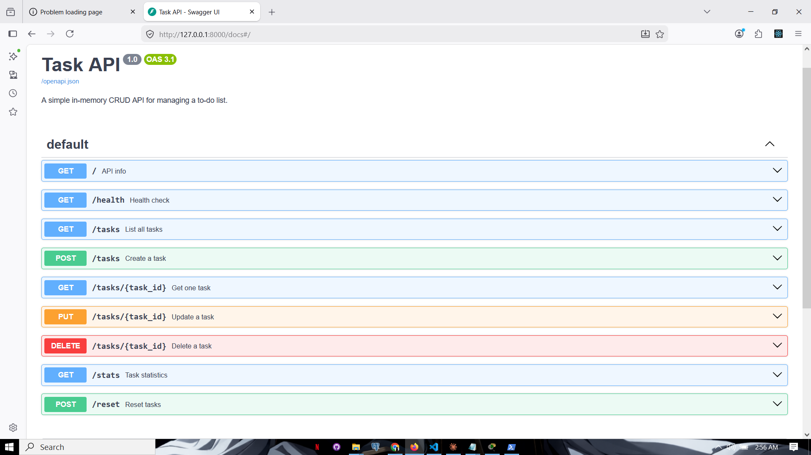

# Task API

A simple in-memory CRUD API for managing a to-do list, built with FastAPI as part of the FlyRank Internship — Backend Track, Week 2.

## What this is

This API lets you create, read, update, and delete tasks (CRUD). Data is stored in memory (a Python list) — it resets every time the server restarts.

## How to run it

1. Clone this repo and navigate into it:
git clone <your-repo-url>
cd todo-api
2. Create and activate a virtual environment:
python -m venv venv
venv\Scripts\Activate.ps1   # Windows
source venv/bin/activate    # Mac/Linux
3. Install dependencies:
pip install -r requirements.txt
4. Run the server:
5. Open `http://localhost:8000` in your browser, or `http://localhost:8000/docs` for Swagger UI.

## Endpoints

| Method | Path              | Description                        |
|--------|-------------------|-------------------------------------|
| GET    | /                 | API info                           |
| GET    | /health           | Health check                       |
| GET    | /tasks            | List all tasks (supports `?done=` and `?search=`) |
| GET    | /tasks/{id}       | Get a single task                  |
| POST   | /tasks            | Create a new task                  |
| PUT    | /tasks/{id}       | Update a task                      |
| DELETE | /tasks/{id}       | Delete a task                      |
| GET    | /stats            | Task statistics (total/done/open)  |
| POST   | /reset            | Reset tasks to default 3 examples  |

## Example curl output
curl -i -X POST http://localhost:8000/tasks -H "Content-Type: application/json" -d "{"title":"Test task"}"
HTTP/1.1 201 Created
content-type: application/json
{"id":5,"title":"Test task","done":false}

## Swagger UI

Interactive docs are available at `/docs`.

## The mortality experiment

When the server restarted, only the 3 hardcoded example tasks remained — any tasks created during the session were lost. This happens because data was stored in memory (a Python list), which only exists while the program is running; a database is needed next week to persist data across restarts.
